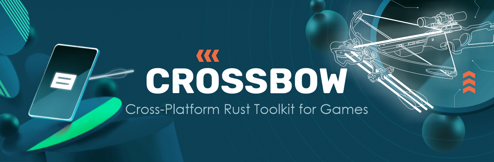

<div>


<a href="https://github.com/dodorare/crossbow/actions"></a>
<a href="https://crates.io/crates/crossbow"></a>
<a href="https://docs.rs/crossbow/"></a>
<a href="https://crates.io/crates/crossbundle"></a>
<a href="https://github.com/dodorare/crossbow/releases"></a>
<a href="https://app.fossa.com/projects/git%2Bgithub.com%2Fdodorare%2Fcrossbow?ref=badge_shield" alt="FOSSA Status"></a>

<strong>Cross-Platform Rust Toolkit for Games 🏹</strong>
</div>

## 🏹 What is Crossbow

A goal of the `crossbow` project is to provide a complete infrastructure for cross-platform game development in rust. In addition, the project simplifies the creation and packaging of crates for Android, iOS, and other platforms. We want to make most of our tools - engine agnostic, to help rust game developers integrate them into their games, engines, and crates.

## 🗂️ Project structure

Crate structure:

| Name | Description | Status |
| ---- | ----------- | ------ |
| [crossbundle](./crossbundle/cli/README.md) | Command-line tool for building applications | ✅ |
| [crossbundle-install](https://github.com/dodorare/crossbow/blob/improve-documentation/docs/crossbundle-install-command.md) | Crossbundle install command to install necessary packages  | ✅ |
| [crossbundle-tools](./crossbundle/tools/README.md) | Toolkit used in `crossbundle` to build/pack/sign bundles | ✅ |
| [crossbundle-derive](./crossbundle/derive/README.md) | Derive macros for projects built with `crossbow` | ✅ |
| [crossbow-ads](./crossbow/ads/README.md) | Plugin for advertisements | 🛠 |
| [crossbow-permissions](./crossbow/permissions/README.md) | Plugin for runtime permissions | 🛠 |
| [android-tools-rs](https://github.com/dodorare/android-tools-rs) | Android-related tools for building and developing application | ✅ |
| [android-manifest-rs](https://github.com/dodorare/android-manifest-rs) | [AndroidManifest](https://developer.android.com/guide/topics/manifest/manifest-intro) serializer and deserializer for Rust | ✅ |
| [apple-bundle-rs](https://github.com/dodorare/apple-bundle-rs) | [AppleBundleResources](https://developer.apple.com/documentation/bundleresources) serializer and deserializer for Rust | ✅ |

## 👁️‍🗨️ Support status

Packaging status:

| Name | Description | Status |
| ---- | ----------- | ------ |
| Android APK | Default build result method. | ✅ |
| Android AAB | Supported via `--aab` flag. | ✅ |
| Apple Debug IPA | Default build result method. Works only on Simulator and could be run on iPhone with Dev Certificate. | 🆗 |
| Apple Release IPA | Not supported yet. Crossbundle should generate `xcodeproj`, but user should build and sign IPA manually. | 🛠 |

Supported game engines:

| Name | Description | Status |
| ---- | ----------- | ------ |
| [Bevy](https://github.com/bevyengine/bevy) | Default build method. Injects [ndk-glue](https://github.com/rust-windowing/android-ndk-rs/tree/master/ndk-glue) into generated tmp `lib.rs` file. | ✅ |
| [Macroquad](https://github.com/not-fl3/macroquad) | Supported via `--quad` flag. Works as [cargo-quad-apk](https://github.com/not-fl3/cargo-quad-apk) but with all `crossbundle` features. | ✅ |

P.S: If you don't find your engine here, open an issue! We are happy to add support for new engines.

✅ = Works and tested — 🆗 = Works but may contain bugs — 🛠 = Under development — 📝 = Planned

## 🌀 Installation

To install crossbundle, run:

```sh
cargo install --git=https://github.com/dodorare/crossbow crossbundle
```

See [installation documentation](https://github.com/dodorare/crossbow/blob/improve-documentation/docs/README.md) for more details on how to setup environment on your platform.

## 🌎 Hello World example

See Hello World example [here](./docs/main-hello-world.md).

## 📚 Full documentation

To learn how to run an example project on your own, build, test, and start using `crossbow` - read our full documentation [here](./docs/README.md).

If you want learn more about `crossbundle` we recommend that you read the information below.

**_⚠️NOTE⚠️_**

---

For the correct work of the tool, you need to set up a development environment (ex. install some libraries and tools - such as Android SDK, Android NDK, XCode, etc).
More information about how to set up the environment in the **Android setup** and **iOS setup** [here](https://github.com/dodorare/crossbow/blob/improve-documentation/docs/README.md).

---

## 📟 CrossBundle CLI

The **crossbundle** is a command-line tool that encapsulates boring stuff of **Android** and **iOS** build/packaging processes and helps mobile developers to create and maintain applications written in **rust** programming language.

### ⚙️ Config Cargo.toml Metadata

To see full Cargo.toml Metadata documentation, visit crossbundle [README](./crossbundle/README.md).

### 🎏 CLI options and flags

To see the complete documentation for each command/subcommand you can write `-h` or `--help`:

```sh
crossbundle -h
crossbundle build android -h
crossbundle run apple -h
crossbundle install -h
# ...
```

Result of `crossbundle -h`:

```text
USAGE:
    crossbundle [OPTIONS] <SUBCOMMAND>

OPTIONS:
    -c, --current-dir <CURRENT_DIR>    The current directory where to run all commands
    -h, --help                         Print help information
    -q, --quiet                        No output printed to stdout
    -v, --verbose                      A level of verbosity, and can be used multiple times
    -V, --version                      Print version information

SUBCOMMANDS:
    build      Starts the process of building/packaging/signing of the rust crate
    help       Print this message or the help of the given subcommand(s)
    install    Installs bundletool and Android Studio's sdkmanager
    log        Attach logger to device with running application
    new        Creates a new Cargo package in the given directory. Project will be ready to
               build with `crossbundle`
    run        Executes `build` command and then deploy and launches the application on the
               device/emulator
```

## ❌ Troubleshooting

### Shared library "<lib_name>" not found

If you ran into problem of missing shared library in the `apk/aab` - you can fix this by placing your `.so` file into `target/<rust-triple>/<profile>/tools/libname.so`. The builder will pick the library up and put it in the final package.

## 📅 Roadmap

Also, check out our [ROADMAP](./ROADMAP.md) for a better understanding of what we are doing right now and what planned.

## 💼 Partners

This project is [part](https://github.com/w3f/Grants-Program/blob/master/applications/crossbow.md) of Web3 Foundation Grants Program.


## 📑 License

Licensed under [Apache-2.0 License](LICENSE).

[](https://app.fossa.com/projects/git%2Bgithub.com%2Fdodorare%2Fcrossbow?ref=badge_large)
