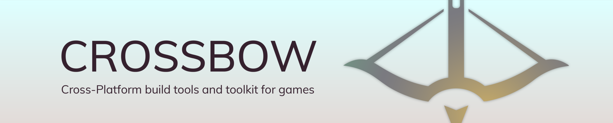

<h1>Creator</h1>

<strong>Mobile Game Framework for Substrate</strong>

## What is Creator?

Goal of the `creator` project is to make it simple to create and build Android and iOS game projects and connect them with Substrate Blockchain.

## WARNING

The `creator` is still in the very early stages of development. APIs, folder structure and features can and will change. Important features are missing. Documentation is sparse. Please don't build any serious projects with `creator` unless you are prepared to be broken by api changes constantly.

## Documentation

To learn how to run example project on your own - read [this](https://github.com/creator-rs/creator/wiki).

## Partners

This project is [part](https://github.com/w3f/Open-Grants-Program/blob/master/applications/mobile-game-framework.md) of Web3 Foundation Grants Program.

## License

Licensed under [Apache-2.0 License](LICENSE).
