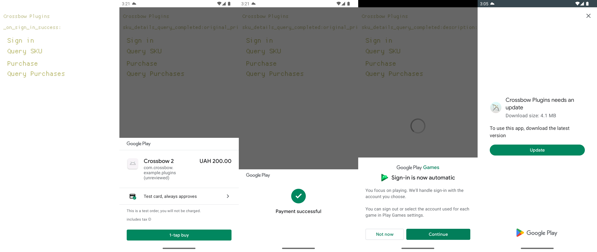

# Crossbow Plugins Example

A complete showcase example that integrates Google Play Billing plugin for Crossbow, Google Play Core plugin for Crossbow, and Google Play Games Services plugin for Crossbow. This example shows how to use Crossbow Plugins.

This example published to Play Store and is available [to download](https://play.google.com/store/apps/details?id=com.crossbow.example.plugins).

> **Important:** Most of plugins will not work in debug mode or with debug key - this example should be built and published to the Play Store to see the same result!

Screenshots:

