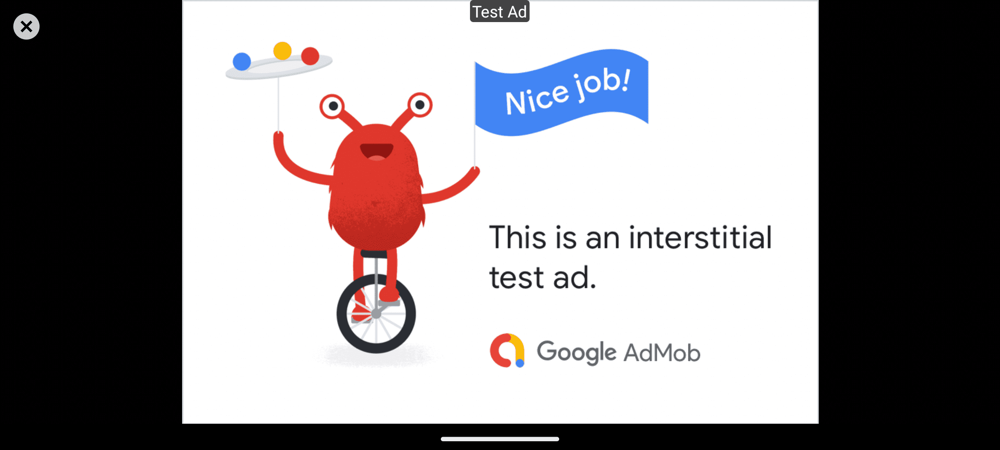

# Crossbow Admob Plugin

## About

This project is a Crossbow Plugin that allows showing AdMob ads from Rust. Without worrying about the building, just download and use.

## Features

| Ad Format | Available |
| ---- | ----------- |
| Banner | ❌ (probably doesn't work with **NativeActivity**) |
| Interstitial | ✅ |
| Rewarded | ✅ |
| [Rewarded Interstitial](https://support.google.com/admob/answer/9884467) | ✅ |
| Native | ❗ |

✅ = Works and tested — 🆗 = Works but may contain bugs — 🛠 = Under development — 📝 = Planned - ❌ = Not working - ❗ = Not planned to be implemented

## Installation

Just add Rust dependencies like this:

```toml
[dependencies]
crossbow = "0.1.8"
[target.'cfg(target_os = "android")'.dependencies]
crossbow-admob = { package = "crossbow-admob-android", version = "0.1.8" }
```

And finally, add this to your Crossbow Android configuration:

```toml
[package.metadata.android]
plugins_remote = ["com.crossbow.admob:admob:0.1.8"]
```

> That's it, now you can start using AdMob ads!

If you want to publish or share your application to show real ads - configure custom APPLICATION_ID through `Cargo.toml` file:

```toml
[[package.metadata.android.manifest.application.meta_data]]
name = "com.google.android.gms.ads.APPLICATION_ID"
value = "<YOUR ID HERE>"
# By default: ca-app-pub-3940256099942544~3347511713
```

## Usage

In your rust project, you will need to get JNIEnv first and retrieve the JNI Singleton instance of AdMob from Crossbow. To do this, simply write the following code:

```rust
#[cfg(target_os = "android")]
use crossbow::android::*;
#[cfg(target_os = "android")]
let crossbow = CrossbowInstance::new();
#[cfg(target_os = "android")]
let admob: crossbow_admob::AdMobPlugin = crossbow.get_plugin()?;
```

To show Interstitial Ad, use following code (remember, there's no async API for this - so `load` and `show` functions should be called as soon as `Sinals` received or `is_initialized()` checked):

```rust
admob.initialize(true, "G", false, true).unwrap();
admob.load_interstitial("ca-app-pub-3940256099942544/1033173712").unwrap();
admob.show_interstitial().unwrap();
```

The result will be like this:



To read signals:

```rust
if let Ok(signal) = admob.get_receiver().recv().await {
    println!("Signal: {:?}", signal);
}
```

Complete documentation you can find [here](https://docs.rs/crossbow-admob-android/).

## Thanks and inspiration

This Plugin was initially inspired by [godot-admob-android](https://github.com/Poing-Studios/godot-admob-android).
